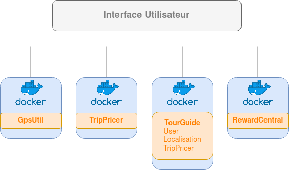
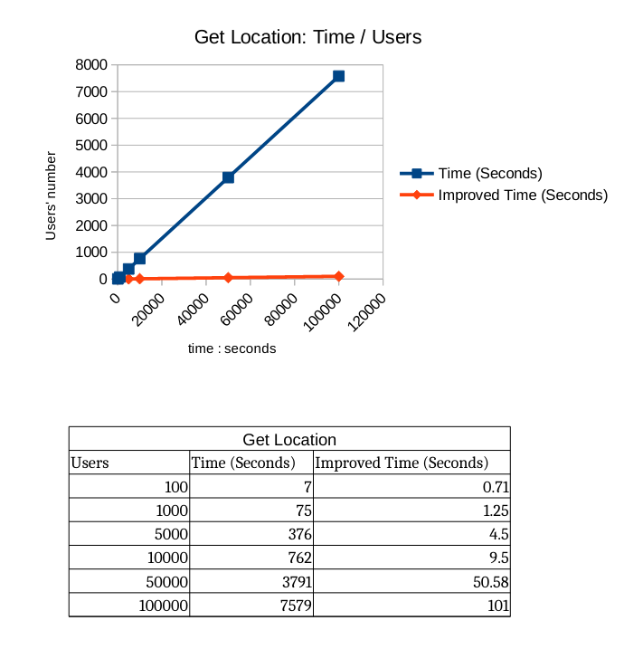
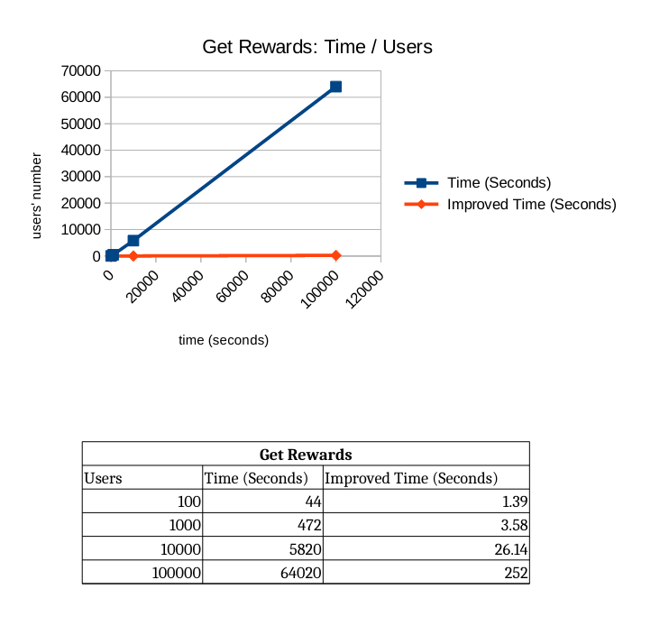

# TripMaster_TourGuide

SpringBoot application - Gradle - Microservices - Feign - Docker

---
**Instructions**

---
<em>run with Docker:</em>  
/TripMaster_TourGuide/docker-compose]$ docker-compose up  
 
<em>run without Docker:</em>  
/TripMaster_TourGuide/tourGuide/src/main/resources/application.properties 
switch properties 
run each module separately 
 
<em>test with userName : </em> 
"internalUser{n}"  with  0<n<99
---
**Table of content**

---
1.Scheme

2.Endpoints

3.Performances

---
**1.Architectural  overview**
---

___
**2.EndPoints**
---
*Tour Guide*
- http://localhost:8080/getUser?userName={userName}
   
   
- http://localhost:8080/getLocation?userName={userName}
- http://localhost:8080/getRewards?userName={userName}
   
   
- http://localhost:8080/getNearbyAttractions?userName={userName}
   
   
- http://localhost:8080/getTripDeals?userName={userName}
- http://localhost:8080/preferences?userName={userName}&numberOfAdults={numberOfAdults}&numberOfChildren={numberOfChildren}&tripDuration={tripDuration}
   
   
- http://localhost:8080/getAllCurrentLocations

___
**3.Performances**
---

___

___